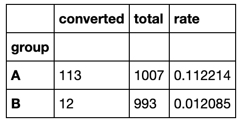
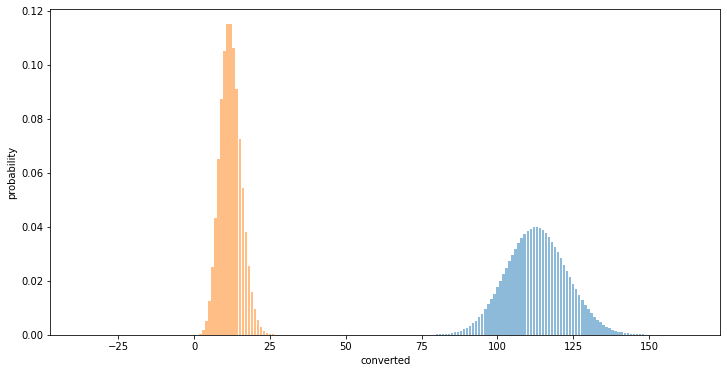
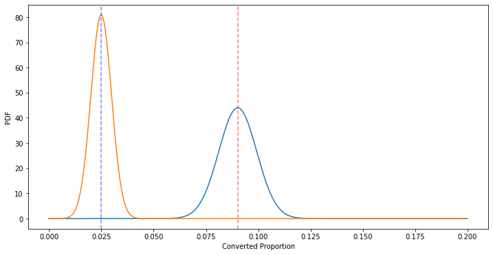
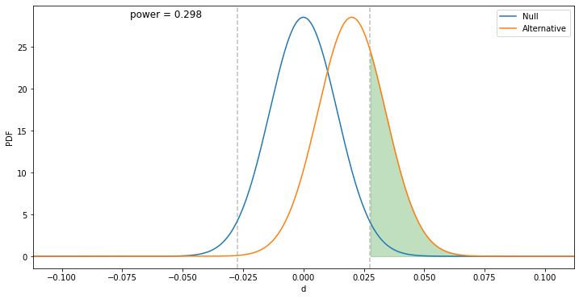
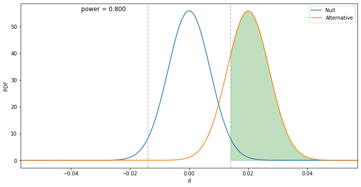

# AB_Testing

1. [Experiment Overview](#1-experiment-overview)
2. [Test Running](#2-test-running)
3. [Analyzing Data](#3-analyzing-data)


## 1. Experiment Overview
Experiment Name: Automated decision making in Loan management

It is conducted by KD Bank, a bank in Ukraine dedicated to retail banking - with the overall business goal of maximizing profit and minimize number of risky loan applications

### 1.1 Current Conditions Before Change

At the time of this experiment, KD Bank currently have loan managers that classify manually safe or risky loan applications.
Managers decide about application status based on their intuition and feelings.

### 1.2 Description of Experimented Change

In the experiment, KD Bank tested a change where if bank use automated decision making based on decision tree learning algorithm. Instead of human (manager) decision company will use automated decision.

### 1.3 Experiment Hypothesis

Null Hypothesis: Using automated decision making does not affect the number(probability) of loan returning

Alternative hypothesis: Using automated decision making affect the number (probability) of loan returning

1.3 Experiment Details

Noting that such data is not publicly available we will generate dataset for this experiment.

## 2.Test Running

We need two types of metrics for a successful experiment (or at least a safe one); Invariate and evaluation metrics. Before running the test, we will know the baseline conversion rate and the desired lift or increase in loan returning that we would like to test.

```
bcr = 0.10  # baseline conversion rate
d_hat = 0.02  # difference between the groups
```

The result of this section will be a table, and it is presented below:



It looks like the difference in conversion rates between the two groups is -0.1 which is less than the lift we initially wanted of 0.02. At this point we have not measured how confident we are in this result. This can be mitigated by looking at the distributions of the two groups.

## 3. Analyzing Data

**Binomial Distribution**



We can see that the peak of the test group results is lower than the control group. How do we interpret the difference in peak probability? We should focus instead on the conversion rate so that we have an apples-to-apples comparison. In order to calculate this, we need to standardize the data and compare the probability of successes, p, for each group.

**Bernoulli Distribution and the Central Limit Theorem**

In order to calculate the difference between the two groups, we need to standardize the data. Because the number of samples might be different between the two groups, we should compare the probability of successes, p.



The dashed lines represent the mean conversion rate for each group. The distance between the red dashed line and the blue dashed line is equal to d_hat.

**Compare the Null Hypothesis vs. the Alternative Hypothesis**



The green shaded area represents the statistical power, and the calculated value for power is also displayed on the plot. The gray dashed lines in the plot above represent the confidence interval (95% for the plot above) for the null hypothesis. Statistical power is calculated by finding the area under the alternative hypothesis distribution and outside of the confidence interval of the null hypothesis.

**Minimum sample size**



The calculated power for this sample size was approximately 0.80. Therefore, if our design change had an improvement in conversion of about 2 percent, we would need at least 3843 samples in each group for a statistical power of at least 0.80.

